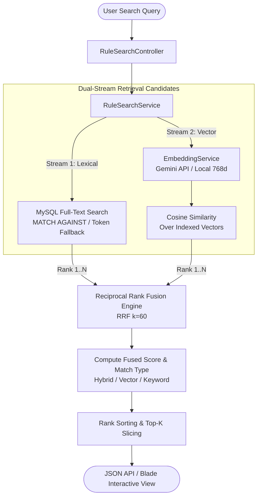

# ⚖️ Rule Vector Search Engine (គតិយុត្តិ)

[](https://laravel.com)
[](https://php.net)
[](https://mysql.com)
[](https://ai.google.dev)
[](https://tailwindcss.com)
[](tests)

> **Intelligent Semantic & Hybrid Search Engine for Legal and Regulatory Documents**
> Built for Khmer Unicode regulatory texts (Royal Decrees, Sub-decrees, Ministerial Declarations / ព្រះរាជក្រឹត្យ អនុក្រឹត្យ ប្រកាស) using **MySQL Full-Text Search**, **Google Gemini AI Embeddings (768-dim)**, and **Reciprocal Rank Fusion (RRF)**.

---

## 📖 Table of Contents

- [Overview](#-overview)
- [Key Features](#-key-features)
- [How Hybrid Search & RRF Work](#-how-hybrid-search--rrf-work)
- [Architecture & Search Pipeline](#-architecture--search-pipeline)
- [System Requirements](#-system-requirements)
- [Quick Start Installation](#-quick-start-installation)
- [Environment Configuration](#-environment-configuration)
- [Database & Seeders](#-database--seeders)
- [API Reference](#-api-reference)
- [Automated Testing](#-automated-testing)
- [Project Structure](#-project-structure)
- [License](#-license)

---

## 🌟 Overview

Searching through legal documents, articles, and regulatory decrees in **Khmer Unicode** often fails with traditional keyword matching due to complex phrasing, word boundaries without spaces, synonyms, and natural language intent.

This project delivers a **production-ready demo** that bridges lexical and semantic discovery:
1. **Lexical Match (FTS)**: Accurately retrieves exact legal references, article numbers (e.g. `មាត្រា ៦`, `ប្រការ ៨`), and exact terms.
2. **Semantic Match (Vector Embeddings)**: Understands conceptual questions (e.g. *"តើត្រូវបង់ប្រាក់ប៉ុន្មានរាល់ឆ្នាំ?"* maps directly to annual membership contribution articles without needing the exact statutory keywords).
3. **Reciprocal Rank Fusion (RRF $k=60$)**: Merges both candidate ranking streams into an unbiased, high-relevance fused score.

---

## ✨ Key Features

- **Dual-Stream Hybrid Retrieval**:
  - **Stream 1**: MySQL InnoDB Composite Full-Text Search (`document_title`, `article_no`, `content_chunk`) with Unicode n-gram fallback.
  - **Stream 2**: Semantic vector similarity using pure PHP Cosine Similarity.
- **Reciprocal Rank Fusion (RRF)**:
  - Standard algorithmic score fusion ($k=60$):
    $$\text{RRF}(d) = \sum_{m \in M} \frac{1}{k + \text{rank}_m(d)}$$
  - Transparent match badges: `Semantic Vector Match`, `Exact Keyword Match`, and `Hybrid Match`.
- **Google Gemini Embedding Integration**:
  - Connects to Google Generative Language API (`gemini-embedding-001`, 768 dimensions).
  - **Built-in Offline Engine**: Includes a deterministic L2-normalized pseudo-embedding generator with Khmer character n-gram projections. Teammates can test and run the entire search engine locally **without needing an API key**!
- **Interactive Single-Page UI (Blade + Tailwind CSS)**:
  - Live real-time search with 300ms debounce and `AbortController` cancellation.
  - Instant score breakdown (RRF score, Cosine similarity %, keyword rank, vector rank).
  - Quick-search sample query pills.
  - In-browser modal to add and vectorize new legal rules dynamically.
  - One-click copy article text to clipboard.
- **Rich Seed Data Included**:
  - Curated legal corpus from the **Board of Engineers of Cambodia (គណៈវិស្វករកម្ពុជា - BEC)**.
  - Full authentic legal corpus in `database/data/bec_legal_corpus.txt`.

---

## 🔬 How Hybrid Search & RRF Work

| Retrieval Stream | Strength | Weakness | Handled By |
| :--- | :--- | :--- | :--- |
| **Lexical (Keyword FTS)** | Pinpoint accuracy for citations, exact article numbers, and names. | Misses synonyms, semantic concepts, and varied wording. | MySQL Full-Text + Regex Tokenizer |
| **Semantic (Vector Search)** | Understands user intent, meaning, questions, and context. | Can rank conceptually similar but legally irrelevant items above exact article numbers. | Google Gemini 768d + Cosine Sim |
| **Hybrid + RRF ($k=60$)** | Combines top candidates from both streams; items appearing in both rank highest. | Needs careful normalization. | RRF Formula ($1 / (60 + \text{rank})$) |

---

## 🏗️ Architecture & Search Pipeline



---

## 💻 System Requirements

- **PHP**: `^8.2` or `^8.3` (with extensions: `pdo_mysql`, `mbstring`, `curl`, `json`)
- **Composer**: `2.x`
- **Database**: MySQL `8.0+` (or MariaDB `10.5+` with InnoDB FTS support)
- **Node.js**: (Optional - Tailwind CSS runs via CDN in demo mode)
- **Gemini API Key**: (Optional - an offline fallback engine is included)

---

## 🚀 Quick Start Installation

Follow these steps to get the project up and running locally:

### 1. Clone the Repository
```bash
git clone https://github.com/ReaksmeyDev/vector_search.git
cd victor_search
```

### 2. Install PHP Dependencies
```bash
composer install
```

### 3. Setup Environment File
```bash
cp .env.example .env
php artisan key:generate
```

### 4. Configure Database in `.env`
Create a database in your local MySQL instance (e.g., `rule_data` or `victor_search`):
```sql
CREATE DATABASE rule_data CHARACTER SET utf8mb4 COLLATE utf8mb4_unicode_ci;
```

Update your `.env` database configuration:
```env
DB_CONNECTION=mysql
DB_HOST=127.0.0.1
DB_PORT=3306
DB_DATABASE=rule_data
DB_USERNAME=root
DB_PASSWORD=your_password
```

### 5. (Optional) Configure Google Gemini API Key
If you have a Gemini API key:
```env
GEMINI_API_KEY=your_gemini_api_key_here
GEMINI_EMBEDDING_MODEL=gemini-embedding-001
EMBEDDING_API_TIMEOUT=15
```
> 💡 **Note**: If `GEMINI_API_KEY` is left blank, the application automatically uses the **built-in deterministic 768-dim local vector generator**. You can demo and test everything without an internet connection or API credits.

### 6. Run Migrations & Seed the Database
```bash
# Run database schema migration
php artisan migrate

# Seed sample engineering regulatory rules (8 curated articles)
php artisan db:seed

# OR seed the full authentic Board of Engineers (BEC) legal rules corpus:
php artisan db:seed --class=BecLegalRulesSeeder
```

### 7. Start the Local Server
```bash
php artisan serve
```

Visit the application in your browser:
👉 **[http://127.0.0.1:8000](http://127.0.0.1:8000)**

---

## 🔍 Sample Queries to Try

Once the app is running, try searching these queries to see how Hybrid & Vector search behave:

| Query (Khmer) | Concept / English Meaning | Expected Match Behavior |
| :--- | :--- | :--- |
| `លក្ខខណ្ឌចុះបញ្ជីវិស្វករអាជីព` | Requirements to register as a Professional Engineer | **Hybrid Match** (Matches both keyword and semantics in មាត្រា ៦) |
| `ថ្លៃបង់ប្រាក់ភាគទានប្រចាំឆ្នាំ` | Annual membership contribution fee | **Hybrid Match** (Retrieves មាត្រា ១៨ with exact fee amounts) |
| `តើត្រូវបង់ប្រាក់ប៉ុន្មានរាល់ឆ្នាំ?` | How much do I have to pay every year? | **Semantic Vector Match** (Finds fee rule without the formal word "ភាគទាន") |
| `ទណ្ឌកម្មខាងវិន័យ` | Disciplinary sanctions & penalties | **Hybrid Match** (Retrieves មាត្រា ២៧ outlining penalties) |
| `ការិយាល័យកោសល្យវិច័យ` | Forensic / inspection office | **Exact Keyword Match** (Discovers Prakas 167 office duties) |

---

## ⚙️ Environment Configuration Reference

| Environment Variable | Default | Description |
| :--- | :--- | :--- |
| `APP_NAME` | `Laravel` | Application name |
| `APP_URL` | `http://localhost:8000` | Application base URL |
| `DB_CONNECTION` | `mysql` | Database driver (`mysql` recommended for FTS) |
| `DB_DATABASE` | `rule_data` | Target database name |
| `GEMINI_API_KEY` | *(empty)* | Google Gemini API key for `embedContent` |
| `GEMINI_EMBEDDING_MODEL` | `gemini-embedding-001` | Embedding model identifier |
| `EMBEDDING_API_TIMEOUT` | `15` | Timeout in seconds for embedding API requests |

---

## 🗄️ Database Schema & Storage

The core table `rules` stores both traditional text and vector embeddings:

```sql
CREATE TABLE `rules` (
  `id` bigint unsigned NOT NULL AUTO_INCREMENT,
  `document_title` varchar(255) NOT NULL,
  `document_type` varchar(100) NOT NULL,
  `article_no` varchar(100) DEFAULT NULL,
  `content_chunk` text NOT NULL,
  `embedding` json DEFAULT NULL,       -- Array of 768 float values
  `indexed_at` timestamp NULL DEFAULT NULL,
  `created_at` timestamp NULL DEFAULT NULL,
  `updated_at` timestamp NULL DEFAULT NULL,
  PRIMARY KEY (`id`),
  FULLTEXT KEY `rules_fulltext_idx` (`document_title`,`article_no`,`content_chunk`)
) ENGINE=InnoDB DEFAULT CHARSET=utf8mb4 COLLATE=utf8mb4_unicode_ci;
```

---

## 📡 API Reference

The application exposes both web UI and JSON REST endpoints:

### 1. Hybrid Search
- **Endpoint**: `GET /` or `GET /demo`
- **Headers**: `Accept: application/json`
<!-- - **Query Parameters**: -->
  - `query` *(string, required)*: The search term or natural language question.
  - `sort_by` *(string, optional)*: `vector_rank` (default) or `rrf_score`.

**Example Request:**
```bash
curl -X GET "http://127.0.0.1:8000/?query=លក្ខខណ្ឌចុះបញ្ជីវិស្វករអាជីព" \
     -H "Accept: application/json"
```

**Example Response:**
```json
{
  "success": true,
  "query": "លក្ខខណ្ឌចុះបញ្ជីវិស្វករអាជីព",
  "engine": "hybrid_rrf",
  "count": 5,
  "execution_time_ms": 38.45,
  "results": [
    {
      "id": 2,
      "document_title": "ព្រះរាជក្រឹត្យ ស្ដីពីការបង្កើតគណៈវិស្វករកម្ពុជា",
      "document_type": "ព្រះរាជក្រឹត្យ",
      "article_no": "មាត្រា ៦",
      "content_chunk": "ដើម្បីអាចចុះបញ្ជីជា «វិស្វករអាជីព» (Professional Engineer)...",
      "snippet": "ដើម្បីអាចចុះបញ្ជីជា «វិស្វករអាជីព»...",
      "rrf_score": 0.03279,
      "keyword_rank": 1,
      "vector_rank": 1,
      "cosine_similarity": 0.8924,
      "fts_score": 3.412,
      "match_type": "hybrid",
      "match_type_label": "Hybrid Match (FTS + Vector)"
    }
  ]
}
```

---

### 2. Ingest New Legal Rule
- **Endpoint**: `POST /rules`
- **Headers**: `Accept: application/json`, `Content-Type: application/json`

**Example Request:**
```bash
curl -X POST "http://127.0.0.1:8000/rules" \
     -H "Accept: application/json" \
     -H "Content-Type: application/json" \
     -d '{
       "document_title": "អនុក្រឹត្យ ស្ដីពីការបន្តការអភិវឌ្ឍវិជ្ជាជីវៈវិស្វកម្ម",
       "document_type": "អនុក្រឹត្យ",
       "article_no": "មាត្រា ៣២",
       "content_chunk": "វិស្វករអាជីពត្រូវចូលរួមវគ្គបណ្តុះបណ្តាលបន្តវិជ្ជាជីវៈ (CPD) ឱ្យបានយ៉ាងតិច ៣០ ក្រេឌីត ក្នុងរយៈពេល ៣ឆ្នាំ។"
     }'
```

**Example Response:**
```json
{
  "success": true,
  "message": "វិធានត្រូវបានបញ្ចូល និងបង្កើត Gemini Vector ដោយជោគជ័យ!",
  "rule": {
    "id": 9,
    "document_title": "អនុក្រឹត្យ ស្ដីពីការបន្តការអភិវឌ្ឍវិជ្ជាជីវៈវិស្វកម្ម",
    "document_type": "អនុក្រឹត្យ",
    "article_no": "មាត្រា ៣២",
    "content_chunk": "វិស្វករអាជីពត្រូវចូលរួមវគ្គបណ្តុះបណ្តាលបន្តវិជ្ជាជីវៈ (CPD)...",
    "vector_dimensions": 768
  }
}
```

---

## 🧪 Automated Testing

The project includes unit and feature test suites covering vector math, embedding dimension validation, seeder stability, and HTTP search endpoints.

Run the test suite with:
```bash
php artisan test
```

Tests run seamlessly using **SQLite in-memory** (`:memory:`) without needing a live MySQL server or network calls.

---

## 📂 Project Structure

```text
victor_search/
├── app/
│   ├── Http/
│   │   ├── Controllers/
│   │   │   └── RuleSearchController.php     # Search orchestration & rule ingestion
│   │   └── Requests/
│   │       └── StoreRuleRequest.php         # Validation with custom Khmer error messages
│   ├── Models/
│   │   └── Rule.php                         # Rule model & pure PHP Cosine Similarity math
│   └── Services/
│       ├── EmbeddingService.php             # Gemini Embeddings API & offline local vector generator
│       └── RuleSearchService.php            # Dual-stream retrieval & Reciprocal Rank Fusion (k=60)
├── config/
│   └── services.php                         # Gemini API key and model config
├── database/
│   ├── data/
│   │   └── bec_legal_corpus.txt             # Raw legal corpus from Board of Engineers
│   ├── migrations/
│   │   └── 2026_10_08_000001_create_rules_table.php  # Schema & MySQL FullText index
│   └── seeders/
│       ├── DatabaseSeeder.php               # Main seeder caller
│       ├── RuleDemoSeeder.php               # Quick demo rules dataset
│       └── BecLegalRulesSeeder.php          # Comprehensive BEC authentic legal rules
├── resources/
│   └── views/
│       └── demo.blade.php                   # Interactive Tailwind UI with live debounced search
├── routes/
│   └── web.php                              # Search & ingestion routes
└── tests/
    ├── Feature/
    │   └── RuleSearchFeatureTest.php        # End-to-end API and UI tests
    └── Unit/
        └── RuleVectorSearchTest.php         # Vector math & semantic cosine validation
```

---

## 📄 License

This demo project is open-sourced
